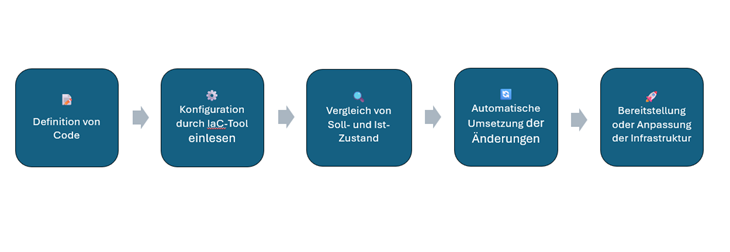
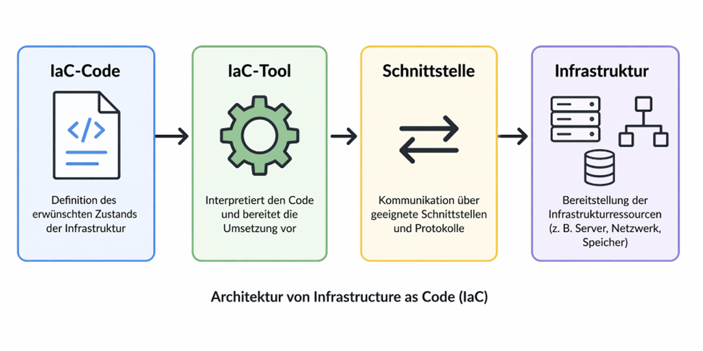
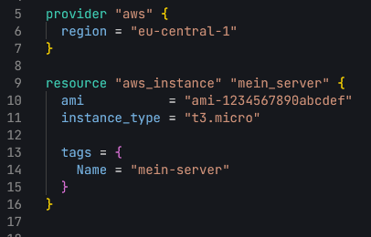

# Infrastructure as Code

**Erstellt von:** Tobias Blazovich

**Personenkennzeichen:** 2410640024

**Datum:** 26.04.2026
## 1. Begriffserklärung

**Infrastructure as Code (IaC)** ist ein Ansatz zur Verwaltung von
IT-Infrastruktur, bei dem Ressourcen wie Server, Netzwerke oder
Datenbanken nicht mehr manuell eingerichtet werden, sondern durch Code
definiert und automatisch bereitgestellt werden. Anstatt Systeme
einzeln über Benutzeroberflächen oder Befehle zu konfigurieren, wird
der gewünschte Zustand der Infrastruktur in Konfigurationsdateien
definiert.

Diese Dateien können gespeichert, versioniert und wiederverwendet
werden. Dadurch kann die Infrastruktur wie Code verwaltet werden.
Änderungen sind jederzeit nachvollziehbar und können bei Bedarf rückgängig gemacht werden.
Dies erhöht die Transparenz und reduziert
Fehler, die bei manueller Konfiguration entstehen. 
Das zentrale Ziel von IaC ist es, die Bereitstellung von Infrastruktur effizienter,
konsistenter und weniger fehleranfällig zu gestalten.

## 2. Kontext und Einsatzbereiche

Infrastructure as Code wird vor allem in modernen IT-Umgebungen
eingesetzt, in denen eine schnelle, flexible und zuverlässige
Bereitstellung von Infrastruktur erforderlich ist. Dies ist
insbesondere bei großen und dynamischen Systemen der Fall.

Ein besonders wichtiger Anwendungsbereich sind Cloud-Umgebungen, in
denen Ressourcen wie virtuelle Maschinen, Netzwerke oder Speicher
automatisiert erstellt und angepasst werden. IaC standardisiert und
automatisiert diese Prozesse und ist eng mit DevOps-Praktiken
verknüpft. Infrastruktur wird dabei nicht mehr getrennt von der
Software betrachtet, sondern als Teil des Entwicklungsprozesses
integriert. Dadurch können vollständige Umgebungen für Entwicklung,
Test und Produktion konsistent bereitgestellt werden.

Zusätzlich spielt IaC eine wichtige Rolle in CI/CD-Pipelines
(Continuous Integration / Continuous Deployment). In diesen Pipelines
 wird Infrastruktur gemeinsam mit der Anwendung automatisiert
bereitgestellt, getestet und ausgerollt. IaC stellt dabei sicher, dass
die Infrastruktur jederzeit dem definierten Soll-Zustand entspricht
und zuverlässig reproduziert werden kann.

## 3. Technische Funktionsweise

Der Ablauf von Infrastructure as Code (IaC) folgt einem klar strukturierten Prozess. 
Zunächst wird der gewünschte Zustand der
Infrastruktur in Form von Code definiert. Diese Konfiguration wird von
einem IaC-Tool eingelesen und mit dem aktuellen Zustand der
bestehenden Infrastruktur verglichen.

Hierfür greift das Tool über Schnittstellen und APIs auf die
Zielumgebung zu und ermittelt den tatsächlichen Ist-Zustand.
Anschließend wird eine Differenz zwischen Soll- und Ist-Zustand
berechnet. Auf Basis dieser Abweichungen werden automatisch die
notwendigen Änderungen geplant und umgesetzt.
 Dieser Prozess folgt dem sogenannten
„Desired State"-Prinzip (Soll-Zustand), bei dem das System
kontinuierlich darauf ausgerichtet ist, den definierten Zielzustand zu
erreichen.
 
 

*Abbildung 1: Technische Funktionsweise von Infrastructure as Code*
 

### 3.1 Imperativer Ansatz

Beim imperativen Ansatz beschreibt der Benutzer den genauen Ablauf zur
Zielerreichung. Dabei werden alle einzelnen Schritte sowie deren
Reihenfolge explizit festgelegt.

#### 3.1.1 Beispiel:

- Server erstellen

- Betriebssystem installieren

- Software installieren

- Konfiguration durchführen

### 3.2 Deklarativer Ansatz

Beim deklarativen Ansatz wird ausschließlich der gewünschte
Zielzustand definiert. Die konkrete Umsetzung übernimmt das System
automatisch. Dieser Ansatz ist idempotent, das heißt, wiederholte
Ausführungen führen stets zum gleichen Systemzustand.

#### 3.2.1 Beispiel:

- Es sollen drei Server mit einer bestimmten Konfiguration vorhanden
  sein.

## 4. Architektur

Die Architektur von Infrastructure as Code besteht aus mehreren
zentralen Komponenten, die zusammenarbeiten. Im Mittelpunkt steht der
IaC-Code, in dem der gewünschte Zustand der Infrastruktur definiert
wird.

Dieser Code wird von einem IaC-Tool wie Terraform oder Ansible
interpretiert. Das Tool fungiert als Vermittler zwischen dem Code und
der Zielumgebung. Die Kommunikation erfolgt über
geeignete Schnittstellen und Protokolle mit der jeweiligen
Infrastrukturplattform.

Diese kann sowohl eine Cloud-Plattform als auch eine lokale oder
virtualisierte IT-Umgebung sein. Die Zielumgebung stellt schließlich
die benötigten Infrastrukturressourcen wie virtuelle Maschinen,
Netzwerke oder Speicher bereit. Diese Architektur ermöglicht eine
klare Trennung zwischen Definition, Steuerung und Ausführung der
Infrastruktur.
 
 

*Abbildung 2: IaC Architektur*
 
## 5. Tools, Produkte und Technologien 

Im Bereich Infrastructure as Code (IaC) kommen verschiedene Tools und
Technologien zum Einsatz. Grundsätzlich wird zwischen Tools zur
Bereitstellung von Infrastruktur (Provisioning) und Tools zur
Konfiguration von Systemen unterschieden.

Provisioning-Tools dienen der automatisierten Erstellung und
Verwaltung von Infrastrukturressourcen. Beispiele:

- Terraform

- Opentofu

- Pulumi

Konfigurationsmanagement-Tools werden hingegen verwendet, um
bestehende Systeme zu konfigurieren und Anwendungen bereitzustellen.
Beispiele:

- Ansible

- Puppet

- Chef

Die Kommunikation zwischen IaC-Tools und der Zielumgebung erfolgt über
standardisierte Schnittstellen und Protokolle. Beispiele:

- APIs zur Steuerung von Infrastruktur

- Netzwerkprotokolle wie SSH und HTTPS

Die Zielumgebung kann sowohl Cloud-basierte als auch lokale oder
virtualisierte Infrastrukturen umfassen. Wichtige Anbieter in diesem
Bereich sind unter anderem HashiCorp, Amazon Web Services und
Microsoft.

## 6. Beispiel

 Ein einfaches Beispiel für Infrastructure as Code mit Terraform:
 
 

 
*Abbildung 3: IaC Beispiel*                                                   
 
 Der Code definiert eine virtuelle Maschine in der AWS-Region
 „eu-central-1" mithilfe von Terraform. Dabei werden das Betriebssystem
 (AMI), die Instanzgröße („t3.micro") sowie ein Name zur Identifikation
 festgelegt. Auf diese Weise wird die gewünschte Infrastruktur
 vollständig im Code beschrieben und kann automatisiert bereitgestellt
 werden.

## 7.  Vorteile und Nachteile

| Vorteile       | Beschreibung |
|----------------|-------------|
| Automatisierung | Manuelle Arbeit wird reduziert und Infrastruktur kann schnell bereitgestellt werden. |
| Konsistenz      | Alle Systeme werden nach denselben Vorgaben erstellt, wodurch Fehler vermieden werden. |
| Versionierung   | Änderungen sind nachvollziehbar und können bei Bedarf rückgängig gemacht werden. |
| Skalierbarkeit  | Infrastruktur kann einfach erweitert werden und eignet sich gut für große IT-Umgebungen. |

 

| Nachteile              | Beschreibung |
|--------------------------|-------------|
| Einarbeitungsaufwand     | Die Nutzung von IaC-Tools erfordert zunächst Zeit und Lernaufwand. |
| Fehleranfälligkeit im Code | Fehler im Code können erhebliche Auswirkungen auf die gesamte Infrastruktur haben. |
| Sicherheitsrisiken       | Zugangsdaten und Konfigurationen müssen sorgfältig geschützt werden. |

## 8. Literaturverzeichnis

- Red Hat:
  <https://www.redhat.com/de/topics/automation/what-is-infrastructure-as-code-iac#deklarativer-im-vergleich-zu-imperativen-ansatz>

- IBM: <https://www.ibm.com/de-de/think/topics/infrastructure-as-code>

- ComputerWeekly:
  <https://www.computerweekly.com/de/definition/Infrastructure-as-Code-IAC>

- HashiCorp Terraform Docs:
  <https://developer.hashicorp.com/terraform/docs?utm_source=chatgpt.com>

- Youtube:
  <https://www.youtube.com/watch?si=HUzYWWPjl-kQIXGw&v=POPP2WTJ8es&feature=youtu.be>

## 9. Abbildungsverzeichnis

- Abbildung 1: Technische Funktionsweise von Infrastructure as Code – eigene Darstellung  

- Abbildung 2: Architektur von Infrastructure as Code – eigene Darstellung  

- Abbildung 3: Terraform-Beispiel – eigene Darstellung  