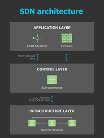

# Software Defined Networking (SDN)

**Autor:** Alexander Dirry
**Datum:** April 2026

## 1. Was ist Software Defined Networking?

Software Defined Networking (SDN) ist ein Netzwerkarchitekturkonzept, bei dem die Steuerung eines Netzwerks von der eigentlichen Datenweiterleitung entkoppelt wird. In klassischen Netzwerken trägt jedes Gerät – also jeder Switch und jeder Router – seine eigene Steuerungslogik in sich. Das bedeutet, Routing-Entscheidungen, Sicherheitsregeln und Quality-of-Service-Konfigurationen sind dezentral auf jedem einzelnen Gerät hinterlegt und müssen dort auch einzeln gepflegt werden.

SDN bricht mit diesem Prinzip: Die Intelligenz des Netzwerks wird aus den einzelnen Geräten herausgezogen und in einer zentralen Software-Instanz, dem sogenannten **SDN-Controller**, gebündelt. Die physischen Netzwerkgeräte werden damit zu einfachen, programmierbaren Datenweiterleitungseinheiten, die lediglich Anweisungen des Controllers ausführen. Das Netzwerk wird dadurch – ähnlich wie eine Anwendung – über Software konfiguriert, überwacht und gesteuert.

Die Grundlagen wurden ab 2007 an der Stanford University im Rahmen des OpenFlow-Projekts gelegt. Der Begriff SDN selbst etablierte sich kurz darauf.

## 2. Kontext und Einsatzbereiche

SDN wird überall dort eingesetzt, wo Netzwerke dynamisch, skalierbar und zentral verwaltbar sein müssen:

| Einsatzbereich | Beschreibung |
| --- | --- |
| **Rechenzentren & Cloud** | Hyperscaler wie Google, Amazon und Microsoft setzen SDN ein, um zehntausende Server flexibel zu vernetzen |
| **Unternehmensnetze** | Zentrale Verwaltung von Standorten, VLANs und Sicherheitsrichtlinien |
| **Campus-Netzwerke** | Automatisierte Onboarding-Prozesse für Geräte und Nutzer |

SDN ist eng mit verwandten Konzepten verknüpft:

- **Network Functions Virtualization (NFV):** Netzwerkfunktionen wie Firewalls oder Load Balancer werden als virtuelle Instanzen betrieben, statt auf dedizierten Hardware-Appliances.
- **Intent-Based Networking (IBN):** Eine Weiterentwicklung von SDN, bei der der Administrator das gewünschte Ergebnis ("Intent") beschreibt und das Netzwerk dies automatisch umsetzt.

## 3. Technische Funktionsweise

### 3.1 Die drei Ebenen der SDN-Architektur

Das SDN-Modell gliedert sich in drei klar getrennte Schichten:

**Infrastructure Layer:**
Die unterste Schicht besteht aus den physischen oder virtuellen Netzwerkgeräten. Diese Geräte enthalten sogenannte *Flow Tables*, in denen Weiterleitungsregeln (Flows) eingetragen sind. Trifft ein Paket ein, prüft das Gerät, ob es zu einem bekannten Flow passt, und handelt entsprechend – also zum Beispiel: weiterleiten, verwerfen oder markieren. Die Geräte treffen dabei *keine eigenständigen Entscheidungen* mehr; sie führen lediglich aus, was der Controller vorgibt.

**Control Layer:**
Der SDN-Controller ist das zentrale Element. Er verfügt über eine vollständige, logische Sicht auf das gesamte Netzwerk (*Global Network View*). Er berechnet Weiterleitungspfade, reagiert auf Ereignisse (z. B. Geräteausfälle), und schreibt entsprechende Flows in die Flow Tables der Datenschicht. Der Controller kann als einzelne Instanz oder als Cluster (für Hochverfügbarkeit) betrieben werden.

**Application Layer:**
Über die Northbound API können externe Anwendungen mit dem Controller kommunizieren. Diese Applikationen können Netzwerkrichtlinien vorgeben, Monitoring-Daten auswerten oder automatisierte Reaktionen auf bestimmte Ereignisse auslösen – zum Beispiel eine automatische Quarantäne eines kompromittierten Geräts.

### 3.2 Flow-basierte Weiterleitung

Der Kernmechanismus in SDN ist die *Flow-basierte Weiterleitung*. Ein Flow ist eine Gruppe von Paketen, die gemeinsame Merkmale aufweisen – etwa denselben Quell- und Ziel-Port oder dieselbe IP-Adresse. Wenn ein Switch ein Paket empfängt, das keinem bekannten Flow entspricht (*Table Miss*), sendet er das Paket (oder eine Anfrage darüber) an den Controller. Dieser entscheidet, was damit geschehen soll, und installiert einen entsprechenden Flow-Eintrag im Switch, sodass zukünftige Pakete dieses Flows direkt im Switch verarbeitet werden können.

## 4. Protokolle, Produkte und Hersteller

### 4.1 Southbound-Protokolle (Controller → Gerät)

| Protokoll | Beschreibung |
| --- | --- |
| **OpenFlow** | Das bekannteste SDN-Protokoll; standardisiert von der ONF; definiert direkt Flow-Einträge in Switches |
| **NETCONF / YANG** | XML-basiertes Protokoll zur Gerätekonfiguration; weit verbreitet in klassischen Netzwerkumgebungen |
| **gRPC / gNMI** | Modernes, binäres Protokoll; wird zunehmend von Hyperscalern und neuen Plattformen eingesetzt |

### 4.2 Kommerzielle Produkte und Plattformen

| Hersteller / Produkt | Beschreibung |
| --- | --- |
| **Cisco ACI** (Application Centric Infrastructure) | Proprietäre SDN-Lösung für Rechenzentren; sehr weit verbreitet in Enterprise-Umgebungen |
| **VMware NSX** | Netzwerkvirtualisierung für VMware-Umgebungen; kombiniert SDN mit NFV |
| **Google B4** | B4 verbindet Rechenzentren weltweit über ein reines SDN-WAN |

### 4.3 Relevante Organisationen und Projekte

- **ONF (Open Networking Foundation):** Treibt SDN-Standardisierung voran; gibt OpenFlow heraus
- **OpenStack Neutron:** Netzwerkkomponente von OpenStack; nutzt SDN-Konzepte für virtuelle Netzwerke
- **Linux Foundation Networking (LFN):** Dachorganisation für Projekte wie OpenDaylight, ONOS, DPDK

## 5. Reales Anwendungsbeispiel: Google B4

Ein besonders bekanntes Praxisbeispiel für SDN ist **Google B4**, das seit 2012 produktiv betrieben wird. Google verbindet seine weltweiten Rechenzentren über ein privates WAN, das vollständig auf SDN-Prinzipien basiert. Anstatt teure kommerzielle WAN-Router einzusetzen, nutzt Google kostengünstige White-Box-Hardware, die über einen zentralen SDN-Controller gesteuert wird.

Das Ergebnis: Google erreicht eine durchschnittliche Auslastung der WAN-Leitungen von über 70 % – klassische WAN-Netze kommen typischerweise auf 30–40 %, da Kapazitäten für Spitzenlast vorgehalten werden müssen. SDN ermöglicht es Google, die Bandbreite dynamisch und bedarfsgerecht zu verteilen, was sowohl die Effizienz als auch die Kosten massiv verbessert.

## Quellen

- VMware.com: [VMware NSX](https://www.vmware.com/products/nsx.html)
- Techtarget.com: [Software defined Networking](https://www.techtarget.com/searchnetworking/definition/software-defined-networking-SDN)
- IT-Schulungen.com: [Was ist Software Defined Networking](https://www.it-schulungen.com/wir-ueber-uns/wissensblog/was-ist-software-defined-networking-sdn.html)
- Wikipedia.org: [Software-defined Networking](https://de.wikipedia.org/wiki/Software-defined_Networking)
- Research.google: [Google B4 Project](https://research.google/pubs/b4-experience-with-a-globally-deployed-software-defined-wan/)
- IT-Schulungen.com: [Cisco ACI](https://www.it-schulungen.com/wir-ueber-uns/wissensblog/cisco-aci-software-defined-networking-fuer-moderne-rechenzentren.html)
- Wikipedia.org: [OpenFlow](https://de.wikipedia.org/wiki/OpenFlow)
- Medium.com: [Google Andromeda](https://medium.com/@mani.saksham12/googles-andromeda-23147b9af86b)
