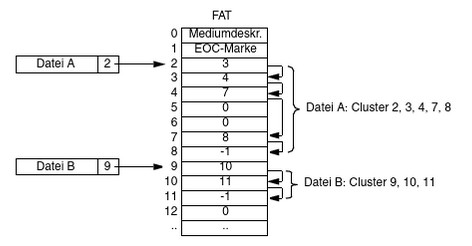
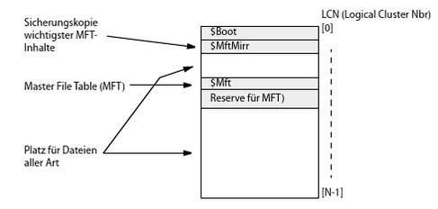
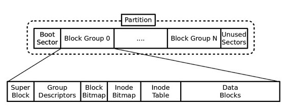
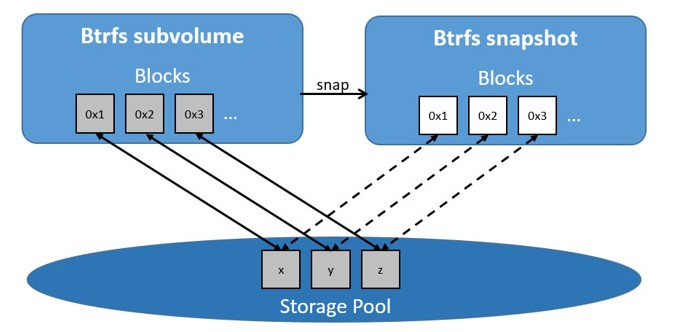

# Filesystems: FAT, NTFS, ext4 und btrfs

## Einleitung

Dieses Dokument bietet eine kompakte, technisch fundierte Ausarbeitung zu vier weit verbreiteten Dateisystemen: FAT, NTFS, ext4 und btrfs. Jedes dieser angeführten Dateisysteme wird im Hinblick auf Besonderheiten und technische Funktionsweise näher behandelt. Ergänzend finden sich Abbildungen, kurze Scripte tabellarische Auflistungen und Quellenangaben für vertiefende Recherchen und Reflexion, wieder.

---

## Inhaltsverzeichnis

- Wozu Dateisysteme?
- FAT
- NTFS
- ext4
- btrfs
- Vergleichstabelle
- Fazit
- Quellen

---

## Wozu Dateisysteme?

Zwecke von Dateisystemen ist die persistente, dauerhafte Ablage und das Lesen von Anwederinformationen, respektive Dateien, sowie ausführbaren Programmen. Vereinfacht gesagt dienen sie der Verwaltung von Daten auf Sekundärspeichern. Durch eine *Verzeichnishierarchie* wird eine sturkturierte Ablage der *logischen* Datei(en) realisiert. 
Ein Dateisystem besteht grundsätzlich immer aus zwei essentiellen Bestandteilen:

- Erweiterung des Betriebessystem im Ein-/Ausgabeteil
- Ein vom Dateisystem festgelegtes Dateiformat auf dem Sekundärspeicher

Dateisystemtypen unterscheiden sich in der Organisation ihrer Daten und Rechteverwaltung auf dem Datenträger, wie sie darauf zugreifen und ihre unterstützte Funktionaliät. *[ProQuest eBook Central, Betriebssysteme : Grundlagen, Konzepte, Systemprogrammierung, v. Eduard Glatz]*

## FAT (File Allocation Table)

FAT ist eines der ältesten und am weitesten verbreiteten Dateisysteme, ursprünglich von Microsoft für MS-DOS entwickelt. Varianten sind *FAT12*, *FAT16*, und *FAT32* die sich hauptsächlich in der verwendeten Cluster- und Adressierungslänge unterscheiden. Aus FAT wurde später ein Derviat names *exFAT* entwickelt, das für die Verwendung von Wechselmedien (USB-Sticks, SD-Karten) optimiert wurde. Bei FAT und auch NTFS handelt es sich um proprietäre Formate von Microsoft. 

Technische Funktionsweise:

- **Metadaten**: FAT verwendet eine zentrale Zuordnungstabelle — die File Allocation Table — die für jede Cluster-Nummer eine Verknüpfung zum nächsten Cluster oder ein End-of-file-Marker speichert. Verzeichniseinträge sind einfache Strukturen mit Namen (im klassischen 8.3-Format oder lange Dateinamen via VFAT-Erweiterung), Attributen, Startcluster und Dateigröße. Die Größe des Eintrages in der FAT ist abhängig von der FAT-Variante.
- **Allocation**: Bei Speicherung wird eine Liste zusammenhängender oder verstreuter Cluster reserviert. Eine zusammenhängende Zuweisung minimiert die Fragmentierung von Dateien. Fragmentierungsherausforderungen stellen sich bei FAT jedoch bei häufigen Lösch- und Schreibzyklen ein.
- **Löschung/Wiederherstellung**: Die Doppelung der FAT (manchmal zwei Kopien) dient als einfaches Redundanzverfahren. Bei Beschädigung kann eine Kopie zur Wiederherstellung verwendet werden. Beim Löschen werde die Einträge aus FAT gelöscht, die Daten bleiben jedoch erhalten bis sie von einer anderen Datei überschrieben werden.
- **Konsistenz**: FAT besitzt kein Journaling; Konsistenzprüfungen (z. B. chkdsk) sind notwendig nach unsauberem Entfernen des Mediums.

Einsatzzwecke: FAT bleibt populär auf portablen Laufwerken und Bootpartitionen, wo Kompatibilität wichtiger ist als Features.

Bild (FAT-Belegungstabelle):


Quellen: *[ProQuest eBook Central, Betriebssysteme : Grundlagen, Konzepte, Systemprogrammierung, v. Eduard Glatz]*
*[https://www.ionos.at/digitalguide/server/knowhow/fat32]*

---

## NTFS (New Technology File System)

NTFS wurde von Microsoft als moderner Nachfolger von FAT entwickelt und ist seit Windows NT das Standard-Dateisystem für Windows. NTFS bietet umfangreiche Funktionen wie Transaktionsjournal (Wiederherstellung), erweiterte Berechtigungen (ACLs), Dateikompression, Verschlüsselung (EFS), Quotas, Reparse-Punkte (Symlinks) und sehr große maximale Dateigrößen.

Technische Funktionsweise:

- **Metadaten-Architektur**: NTFS organisiert Metadaten in *Master File Table (MFT)* — eine zentrale, indexähnliche Struktur, in der jede Datei/Verzeichnis einen Eintrag (Record) hat. MFT enthält Attribute (Daten, Standard-Informationen, Sicherheitsbeschreibungen u.a.). Kleine Dateien können direkt im MFT-Eintrag (resident data) gespeichert werden.
- **Journaling**: NTFS verwendet ein *Transaktionsprotokoll* (NTFS Log file) zur Aufzeichnung von Metadatenänderungen. Damit sind Metadaten-Operationen atomar, was bedeutet, dass nach einem Systemabsturz das Dateisystem konsistent wiederhergestellt werden kann.
- **Allocation & Fragmentierung**: NTFS arbeitet mit B+ Tree-ähnlichen Strukturen (z.B. für Verzeichnisse und MFT-Attribute) und versucht, extents (zusammenhängende Blöcke) für Dateien zu reservieren. Die Fragentierungsproblematik rückt dadurch im Vergleich zu FAT eher in den Hintergrund.
- **Sicherheit & Features**: Umfangreiche ACL-basierte Sicherheit, EFS-Verschlüsselung und Unterstützung für Hardlinks, Junctions und Sparse Files machen NTFS für Server- und Desktop-Anwendungen geeignet.

Einsatzzwecke: Standard für Windows-Installationen, Server-Volumes und Laufwerke, die erweiterte Sicherheit und Features benötigen.

Bild (NTFS MFT Schema):


Quellen: *[ProQuest eBook Central, Betriebssysteme : Grundlagen, Konzepte, Systemprogrammierung, v. Eduard Glatz]*
*[https://learn.microsoft.com/en-us/windows/win32/fileio/ntfs-technical-reference]*

---

## ext4 (Fourth Extended Filesystem)

ext4 ist das Standard-Dateisystem vieler Linux-Distributionen (als Nachfolger von *ext3*). Es wurde entwickelt, um Skalierbarkeit, Leistung und Zuverlässigkeit zu verbessern, ohne die Kompatibilität zu ext3/ext2 zu opfern. Zu den wichtigen Eigenschaften gehören Extents (für effiziente Zuordnung großer Dateien), verzögerte Allokation (delayed allocation), multiblock-Allokation, fast fsck und Journaling-Optionen (data=ordered, writeback, journal).

Technische Funktionsweise:

- **Extents**: Anstatt viele einzelne Blocknummern in *Inodes* zu listen, verwendet ext4 Extents — Bereiche zusammenhängender Blöcke beschrieben durch Startblock und Länge — was Metadaten reduziert und die Performance bei großen Dateien steigert.
- **Journaling**: ext4 bietet ein Journal für Metadaten (optional auch für Daten). Der typische Modus ist "ordered", der verhindert, dass Daten nach Metadaten geschrieben werden, um Inkonsistenzen zu vermeiden.
- **Verzögerte Allokation und Defragmentierung**: Delayed allocation reduziert Fragmentierung, weil das Dateisystem beim Schreiben bessere Entscheidungen über Blockplatzierung trifft.
- **Inode**- und Block-Management: flexiblere Blockgrößen (z. B. 1/2/4 KiB), HTree-Indizes für große Verzeichnisse und Checksums für Journal-Integrität verbessern Robustheit.

Linx Commands:

Die nachfolgenden Linux-Befehle zeigen das Erstellen eines ext4-Dateisystems auf einem auf einer *Volume-Group* erstellten *Logical Volume*. In weiterer Folge wird ein Mount-Point erstellt, der zum Einhängen des Dateisystems und zur weiteren Verwendung desselbigen notwendig ist. Mit fsck wird das File-System abschließend auf Inkonsistenzen gecheckt.

```bash
mkfs.ext4 /dev/vgsafe/lv1
mkdir /home/lv1
mount /dev/vgsafe/lv1 /home/lv1
fsck.ext4 -f /dev/vgsafe/lv1
```

Einsatzzwecke: ext4 eignet sich für allgemeine Linux-Server- und Desktop-Umgebungen, bietet gute Performance und Stabilität.

Bild (ext Filesystem):


Quellen: *[Was ist Ext4 (Ext2, Ext3) – Linux-Dateisystem?, https://recoverhdd.de/blog/the-ext-ext2-ext3-ext4-filesystem.html]*
*[https://ext4.wiki.kernel.org/]*


## btrfs (B-Tree Filesystem)

btrfs (*B-tree FS, Better FS oder alternativ Butter FS*) ist ein modernes *CoW- (Copy-on-Write)* Dateisystem für Linux, entworfen für erweiterte Features wie *Snapshots*, *Subvolumes*, *Checksumming* von Daten und Metadaten, *integrierte RAID-Funktionen*, *Compression und Online-Defragmentierung*. Ziel ist, Funktionen zu bieten, die bislang nur mit externen Tools (LVM + fs + rsync) möglich waren. Außerdem soll das von der Firma Oracle entwickelte Dateisystem die bislang im Linux Umfeld vorherrschenden Dateisysteme ext3 und ext4, mit seinen Größenbeschränkungen, ersetzen.

Technische Funktionsweise:

- **Copy-on-Write (CoW)**: Jede Änderung an Daten oder Metadaten führt dazu, dass neue Blöcke geschrieben werden, statt bestehende zu überschreiben. Das ermöglicht schnellere, atomare Snapshots und reduziert die Notwendigkeit komplexer Journale.
- **B-Baum-Struktur**: btrfs speichert Metadaten und Daten in einer Reihe von B-Bäumen (extent tree, checksum tree, fs tree u. a.), was effiziente Suche, Erweiterung und Konsistenzprüfung ermöglicht.
- **Checksumming**: Daten und Metadaten werden mit Prüfsummen (CRC32C) abgesichert. Bei Verwendung von RAID-1/10 ist bei btrfs automatische Reparatur beschädigter Blöcke möglich.
- **Snapshots & Subvolumes**: Snapshots sind bekanntlich essentiell für Backups und Rollbacks und können direkt für Volumes oder Teile davon erstellt werden.
- **Deduplication & Compression**: Online-Kompression (zlib, zstd) und manuelle/online Dedup-Tools reduzieren Speicherbedarf.

Einsatzzwecke: Ideal für Systeme, die Snapshots, Checksumming und flexible Volume-Funktionen benötigen (z. B. Server, NAS, Desktop mit BTRFS-Snapshots).

Bild (btrfs architecture):


Quelle: *[https://btrfs.wiki.kernel.org/]*
*[Use the BTRFS storage driver | Docker Documentation, https://docker-docs.uclv.cu/storage/storagedriver/btrfs-driver]*

---

## Vergleichstabelle

| Feature | FAT32 | NTFS | ext4 | btrfs |
|---|---:|---:|---:|---:|
| Maximale Dateigröße | 4 GiB - 1 Byte (2 hoch 32  -1) | theoretisch 16 EiB (abhängig von Clustergröße jedoch weniger) | theoretisch 16 TiB bei 4 KiB Block | theoretisch 16 EiB |
| Journaling | nein | ja (Metadaten + Change) | ja (typ. Metadaten) | kein typ. Journaling - jedoch CoW (Snapshots), Checksums |
| Copy-on-Write | nein | nein | nein | ja (zentrales Prinzip) |
| Snapshots | nein | eingeschränkt (VSS auf OS-Ebene) | nein (nur LVM) | ja (native) |
| Typische OS-Unterstützung | Windows, Mac, Linux | Windows (nativ) | Linux (nativ) | Linux (nativ) |
| Use-Cases | Wechselmedien | Windows-Systeme/Server | Linux-Server/Desktop | Linux Server/NAS/Container |

Quelle: *[https://learn.microsoft.com/en-us/windows/win32/fileio/ntfs-technical-reference]*
  *[Was ist Ext4 (Ext2, Ext3) – Linux-Dateisystem?, https://recoverhdd.de/blog/the-ext-ext2-ext3-ext4-filesystem.html]*
  *[https://ext4.wiki.kernel.org/]*
  *[https://btrfs.wiki.kernel.org/]*

---

## Fazit

Dateisysteme sind ein essentieller Bestandteil einer Dateiverwaltung und Strukturierung. Welches Dateisysteme am besten geeignet ist, hängt immer vom jeweiligen Anwendungsfall ab und welches Ziel verfolgt wird. Somit haben auch noch ältere Dateisysteme durchaus ihre Daseinsberechtigung.

---

## Weiterführende Links / Quellen

- ProQuest eBook Central, Betriebssysteme : Grundlagen, Konzepte, Systemprogrammierung, v. Eduard Glatz
- https://www.ionos.at/digitalguide/server/knowhow/fat32
- https://learn.microsoft.com/en-us/windows/win32/fileio/ntfs-technical-reference
- Was ist Ext4 (Ext2, Ext3) – Linux-Dateisystem?, https://recoverhdd.de/blog/the-ext-ext2-ext3-ext4-filesystem.html
- https://ext4.wiki.kernel.org/
- https://btrfs.wiki.kernel.org/
- Use the BTRFS storage driver | Docker Documentation, https://docker-docs.uclv.cu/storage/storagedriver/btrfs-driver


