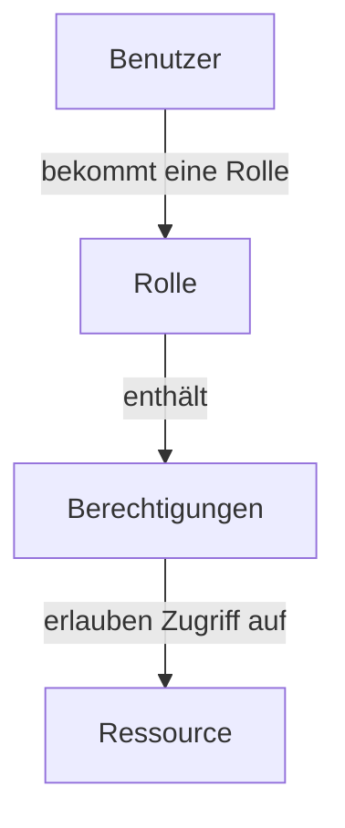

# Role-Based Access Control (RBAC)

## 1. Worum handelt es sich?

**Role-Based Access Control (RBAC)** ist ein Modell für die Zugriffskontrolle in IT-Systemen. Dabei werden Zugriffsrechte auf Basis der Rolle von Benutzern vergeben, anstatt diese einzeln für jeden Mitarbeiter festzulegen.

Die rollenbasierte Berechtigungsvergabe senkt den Verwaltungsaufwand in der IT und ermöglicht die automatische und zielgenaue Provisionierung und Deprovisionierung von Benutzern.

| Benutzer | Rolle | Rechte |
|---|---|---|
| Max | Buchhaltung | Rechnungen lesen und bearbeiten |
| Anna | HR | Mitarbeiterdaten verwalten |
| Tom | Administrator | Benutzer und Systeme verwalten |
| Lisa | Studentin | Lernplattform und Stundenplan nutzen |

## 2. Kontext und Verwendung

RBAC wird vor allem in der IT-Sicherheit und Zugriffsverwaltung verwendet. Es regelt, wer auf welche Daten, Programme oder Systeme zugreifen darf.

Das Modell kommt in vielen Bereichen zum Einsatz, zum Beispiel in:

- Unternehmen
- Schulen
- Behörden
- Krankenhäusern
- Cloud-Plattformen
- Datenbanken
- Betriebssystemen
- Kubernetes
- Active Directory

**Beispiel:**  
In einer Firma darf die Personalabteilung auf Mitarbeiterdaten zugreifen, die Buchhaltung auf Rechnungen. Normale Mitarbeiter dürfen diese sensiblen Daten nicht sehen.

## 3. Grobe technische Funktionsweise

RBAC besteht aus vier wichtigen Elementen:

1. **Benutzer**
2. **Rollen**
3. **Berechtigungen**
4. **Ressourcen**

**Beispiel:**

```text
Anna
 ↓
Rolle: HR
 ↓
Rechte: Mitarbeiterdaten lesen und bearbeiten
 ↓
Ressource: HR-System
```

Ein Administrator erstellt zuerst Rollen. Danach werden diesen Rollen Berechtigungen zugewiesen. Anschließend bekommen Benutzer die passenden Rollen.

Ein Benutzer kann auch mehrere Rollen haben. Dadurch kann ein Benutzer zum Beispiel sowohl auf Finanzdaten als auch auf bestimmte Projektdaten zugreifen.

Wichtig ist das Prinzip **Least Privilege**: Jeder Benutzer bekommt nur die Rechte, die er wirklich für seine Arbeit braucht. Dadurch wird das Risiko von Missbrauch oder Fehlern reduziert.

## 4. Vorteile von RBAC

RBAC hat viele Vorteile, besonders in größeren Organisationen.

| Vorteil | Erklärung |
|---|---|
| Einfachere Verwaltung | Rechte müssen nicht bei jedem Benutzer einzeln eingestellt werden. Man vergibt nur die passende Rolle. |
| Mehr Sicherheit | Benutzer bekommen nur die Rechte, die sie wirklich brauchen. |
| Weniger Fehler | Da Rechte über Rollen vergeben werden, passieren weniger falsche Einzelzuweisungen. |
| Schnelleres Onboarding | Ein neuer Mitarbeiter bekommt durch eine Rolle sofort alle nötigen Zugriffe. |
| Einfacheres Offboarding | Verlässt jemand die Firma, entfernt man einfach die Rollen. |
| Bessere Übersicht | Man kann leichter sehen, wer welche Rechte hat. |
| Zeitersparnis | Administratoren müssen nicht für jede Person alle Rechte einzeln pflegen. |

## 5. Nachteile und Herausforderungen

RBAC hat auch einige Nachteile und Herausforderungen.

| Nachteil | Erklärung |
|---|---|
| Hoher Startaufwand | Die Rollen müssen zuerst geplant und erstellt werden. |
| Rollenexplosion | Wenn zu viele Spezialrollen entstehen, wird das System unübersichtlich. |
| Pflegeaufwand | Rollen müssen regelmäßig überprüft und angepasst werden. |
| Wenig Flexibilität | Kurzfristige Sonderrechte sind manchmal schwer abzubilden. |

**Beispiel:**  
Wenn man für jede kleine Aufgabe eine eigene Rolle erstellt, entstehen schnell sehr viele Rollen. Dadurch kann RBAC kompliziert und unübersichtlich werden.

## 6. Protokolle, Produkte, Tools und Beispiele

RBAC ist kein einzelnes Protokoll, sondern ein Berechtigungskonzept. Es wird jedoch in vielen Systemen und Tools umgesetzt.

| Bereich | Beispiele |
|---|---|
| Verzeichnisdienste | Microsoft Active Directory, LDAP |
| Cloud | AWS IAM, Azure RBAC, Google Cloud IAM |
| Container | Kubernetes RBAC, OpenShift |
| IAM-Tools | Keycloak, Microsoft Entra ID |
| Automatisierung | Ansible Automation Platform |
| Datenbanken | MySQL, PostgreSQL, Oracle Database |

### Verwandte Protokolle und Standards

- LDAP
- SAML
- OAuth 2.0
- OpenID Connect
- SCIM

## 7. Schaubild



### Konkretes Beispiel

```text
Anna → Rolle HR → Zugriff auf Mitarbeiterdaten
Max  → Rolle Buchhaltung → Zugriff auf Rechnungen
Tom  → Rolle Admin → Zugriff auf Server
```

## 8. Beispiel aus der Praxis

Ein neuer Mitarbeiter beginnt in der Buchhaltung.

Ohne RBAC müsste der Administrator einzeln einstellen:

- Zugriff auf E-Mail
- Zugriff auf Finanzsoftware
- Zugriff auf Rechnungsordner
- Zugriff auf Drucker
- Zugriff auf ERP-System

Mit RBAC bekommt der Mitarbeiter einfach die Rolle **Buchhaltung**.

Dadurch erhält er automatisch alle Rechte, die für diese Abteilung nötig sind. Wenn er später in eine andere Abteilung wechselt, wird die Rolle entfernt und eine neue Rolle zugewiesen.

## Quellen

- [Red Hat: Was ist Role-Based Access Control?](https://www.redhat.com/de/topics/security/what-is-role-based-access-control)
- [IONOS: Was ist Role-Based Access Control?](https://www.ionos.at/digitalguide/server/sicherheit/was-ist-role-based-access-control-rbac/)
- [Tenfold: RBAC Rollenbasierte Berechtigungsvergabe](https://www.tenfold-security.com/rbac-rollenbasierte-berechtigungsvergabe/)
- [Tenfold: Rollenmodell und Berechtigungen](https://www.tenfold-security.com/rollenmodell-berechtigungen/)
- [IPG Group: Was ist Role-Based Access Control?](https://www.ipg-group.com/blog/expertenberichte/was-ist-role-based-access-control)
